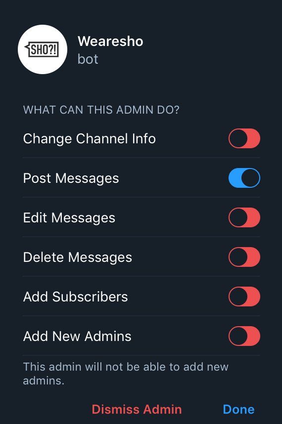
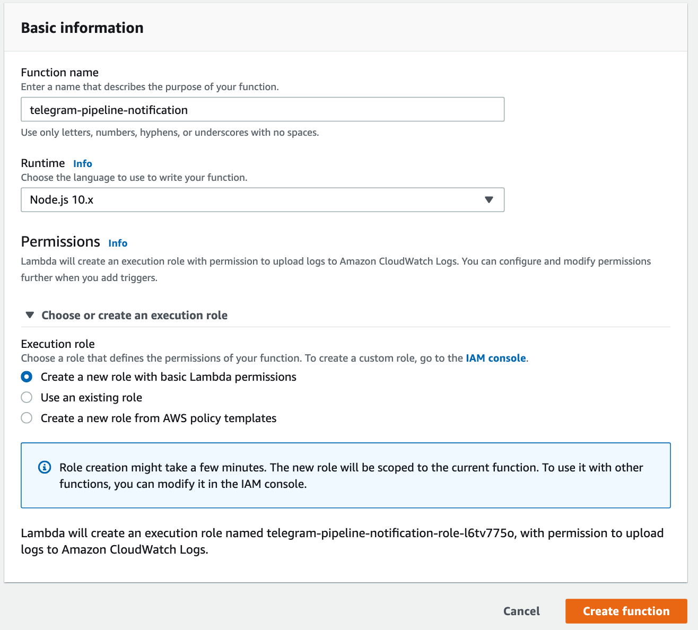
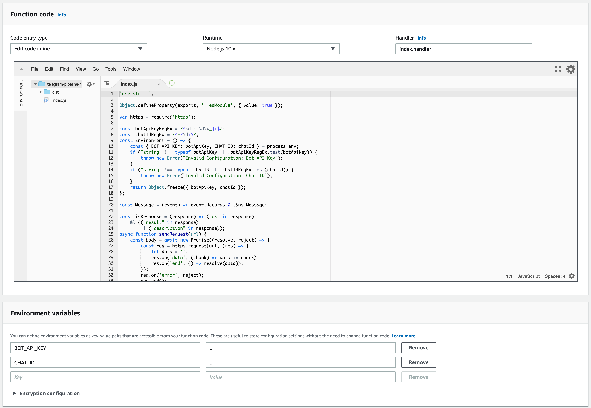

# AWS CodePipeline Telegram Integration

This repository is about integrating
[AWS CodePipeline](https://aws.amazon.com/ru/codepipeline/)
with [Telegram](https://telegram.org/)
to delivery failures and success pipeline notifications.

## Integration

### Step 1. Configure Telegram
 
1. Create [Telegram Bot](https://t.me/BotFather)
2. Create new Telegram Channel.
3. Add bot to channel with *Post Messages* permission.



### Step 2. Create AWS Lambda

#### Using [AWS Console](https://console.aws.amazon.com/)
1. Go to
[Lambda](https://console.aws.amazon.com/lambda/home) -> [Create Function](https://console.aws.amazon.com/lambda/home#/create/function)
2. Use `telegram-pipeline-notification` as function name and `Node.js 10.x` as runtime.
For permissions choose `Create a new role with basic Lambda permissions`.

3. Add code from [telegram-pipeline-notification/dist/index.js](telegram-pipeline-notification/dist/index.js)
to Function Code section.
4. Add environment variables:
- **BOT_API_KEY** - Telegram Bot API Key from *BotFather*
- **CHAT_ID** - Telegram Notification Channel ID

5. Save lambda.

#### Using [AWS CLI](https://docs.aws.amazon.com/cli/latest/reference/lambda/create-function.html)
```bash
wget https://raw.githubusercontent.com/Horat1us/aws-telegram-integration/master/telegram-pipeline-notification/trustPolicy.json -O trustPolicy.json && \
aws iam create-role \
--role-name telegram-pipeline-notification-execution \
--assume-role-policy-document file://trustPolicy.json && \
aws iam attach-role-policy \
--role-name telegram-pipeline-notification-execution \
--policy-arn arn:aws:iam::aws:policy/service-role/AWSLambdaBasicExecutionRole && sleep 2 && \
wget https://raw.githubusercontent.com/Horat1us/aws-telegram-integration/master/telegram-pipeline-notification/dist.zip -O telegram-pipeline-notification.zip && \
aws lambda create-function \
    --function-name telegram-pipeline-notification \
    --runtime nodejs10.x \
    --handler index.handler \
    --role arn:aws:iam::$(aws sts get-caller-identity | jq -r '.Account'):role/telegram-pipeline-notification-execution \
    --zip-file "fileb://./telegram-pipeline-notification.zip" \
    --environment "Variables={BOT_API_KEY=...,CHAT_ID=...}"
```

### Step 3. Create SNS Topic
1. Go to
[SNS](https://console.aws.amazon.com/sns/v3/home) -> [Create Topic](https://console.aws.amazon.com/sns/v3/home#/create-topic)
2. Use `telegram-pipeline-notification-topic` as topic name.


## Links
- [AWS CodePipeline & Slack integration](https://medium.com/@krishnakuntala/aws-codepipeline-slack-integration-41dfaff2414e) 
